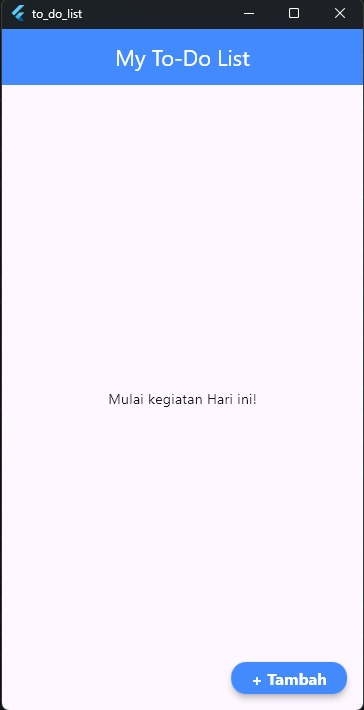
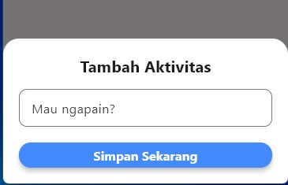
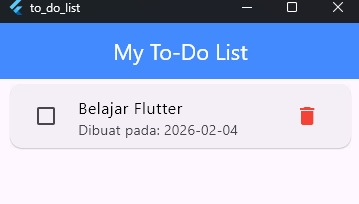
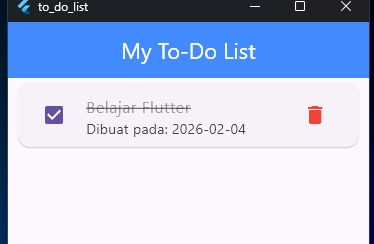

# 📝 Tudulis - Simple & Reactive To-Do App

**Tudulis** adalah aplikasi manajemen tugas sederhana yang dibangun menggunakan **Flutter**. Proyek ini dibuat untuk mendemonstrasikan penerapan **State Management (GetX)** dan **Local Storage** yang efisien.

Aplikasi ini memungkinkan pengguna untuk membuat, memantau, dan menghapus tugas harian mereka tanpa takut data hilang saat aplikasi ditutup.

---

## 📸 Screenshots

| Halaman Utama | Tambah Tugas | Tugas Selesai |
|:---:|:---:|:---:|
|  |  |   |


---

## ✨ Fitur Utama

* Menambahkan Kegiatan/Tugas yang ingin dilakukan hari ini.
* Menampilkan daftar tugas akan diselesaikan.
* Menandai tugas selesai/belum dengan icon *check*.
* Menghapus tugas yang tidak diinginkan atau tidak digunakan lagi

---

## 🛠️ Teknologi yang Digunakan

* **Language:** [Dart](https://dart.dev/)
* **Framework:** [Flutter](https://flutter.dev/)
* **State Management:** [GetX](https://pub.dev/packages/get) 
* **Local Storage:** [GetStorage](https://pub.dev/packages/get_storage) 

<!-- ## 🚀 Cara Menjalankan  -->

<!-- 1.  **Clone Repository ini**
    ```bash
    git clone [https://github.com/ilahammu/tudulis.git](https://github.com/ilahammu/tudulis.git)
    ```

2.  **Masuk ke Folder Proyek**
    ```bash
    cd tudulis
    ```

3.  **Install Dependencies**
    ```bash
    flutter pub get
    ```

4.  **Jalankan Aplikasi**
    ```bash
    flutter run
    ``` -->

---

## 👤 Author

**Ilham Muhijri**
* GitHub: [@ilahammu](https://github.com/ilahammu)
* LinkedIn: [Ilham Muhijri Yosefin](https://www.linkedin.com/in/ilhammuhijri/)

---

*Dibuat dengan ❤️ dan Flutter.*